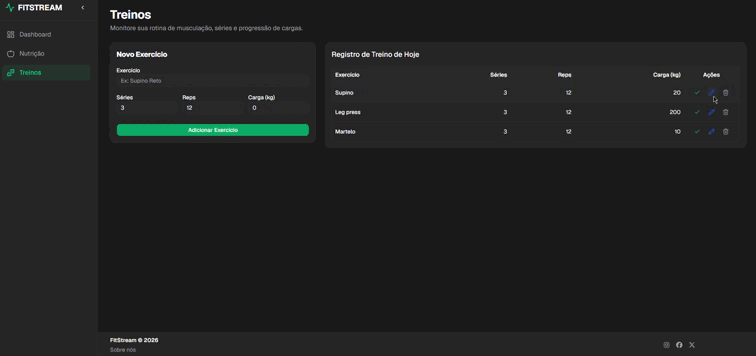

[](https://react.dev/)
[](https://vite.dev/)
[](https://www.typescriptlang.org/)
[](https://tailwindcss.com/)
[](https://vitest.dev/)
[](https://eslint.org/)
[](https://prettier.io/)
[](https://github.com/)

### FitStream - Real-Time Fitness & Nutrition Dashboard

FitStream é uma aplicação web de monitoramento de fitness e nutrição em tempo real.

O front-end consome dados via REST e recebe atualizações instantâneas de eventos através de Server-Sent Events (SSE), integrados a uma arquitetura orientada a eventos no back-end.

---
### 🎥 Demonstração



---
### 🛠️ Tecnologias Utilizadas

- **Core:** React, Vite, TypeScript
- **Estilização:** Tailwind CSS, Shadcn, Radix/Base UI, Lucide Icons
- **Gráficos e Visualização:** Recharts
- **Gerenciamento de Estado & Formulários:** React Hook Form, Zod
- **Comunicação em Tempo Real:** Server-Sent Events (SSE)
- **Testes:** Vitest, JSDOM, React Testing Library
- **Qualidade de Código:** ESLint, Prettier
- **CI/CD:** GitHub Actions

### Backend & Frontend

Este repositório contém exclusivamente o Front-end da aplicação.

[Repostiorio do Backend](https://github.com/LeonardoEnnes/fitstream-api) 

### 🚀 Como Acessar e Executar a Aplicação Localmente

### 📋 Pré-requisitos

- Node.js (versão 20 ou superior recomendada)
- pnpm

---
### 🔧 Passo a Passo

**1. Instale as dependências:**

```bash
pnpm install
```

**2. Inicie o servidor de desenvolvimento:**

```bash
pnpm dev
```

**3. Acesse a aplicação através de:**

```text
http://localhost:5173
```

### Comandos Úteis da CLI

**Rodar os testes unitários:**

```bash
pnpm test
```

**Validar tipos e gerar o build de produção:**

```bash
pnpm build
```

**Executar o linter:**

```bash
pnpm lint
```